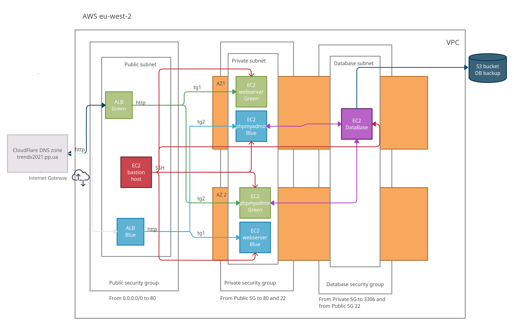

# Green/blue deployment with Terraform, Ansible and Jenkins
## Overview
This repo contains:
- Terraform code to deploy infrastructure in Amazon AWS
- Ansible playbook to setup servers
- Jenkins files to run jobs
- Disaster recovery plan and code to deploy infrastructure to the other (`eu-west-2`) region

## Pre-Requisite
1. AWS account with full access.
2. CloudFlare account with a registered domain name.
3. Installed Jenkins (locally or on a third-party master server).
4. Terraform (Terraform 1.0) should be installed on machine with Jenkins on which terraform templates are running.
5. Ansible should be installed on machine with Jenkins (or your local machine) to create vault secret file.

## Network diagram


## Preparations before the deployment of the project.
### Register AWS account
Full instructions on this subject can be found at the official [Amazon AWS website](https://aws.amazon.com/free).

In general you need to get AWS Access Key and AWS Secret Access Key IDs.

[This article](https://docs.aws.amazon.com/cli/latest/userguide/cli-configure-quickstart.html) explains how to quickly configure basic settings that the AWS Command Line Interface (AWS CLI) uses to interact with AWS.

### Register CloudFlare account and a domain name
Full instructions on this subject can be found at the official [CloudFlare website](https://support.cloudflare.com/hc/en-us/articles/201720164-Creating-a-Cloudflare-account-and-adding-a-website). You need to get [CLOUDFLARE_API_KEY](https://developers.cloudflare.com/api/tokens/create).

You can utilize CloudFlare as a Registrar or another company on your choice.

### Install Jenkins
Full instructions on this subject can be found at the official [Jenkins website](https://www.jenkins.io/download/).

You will need to install the following Jenkins plugins:
- Credentials Binding
- Maven Integration
- Pipeline: API (usually installed by default)
- Pipeline SCM API (usually installed by default)

### Install Terraform
Full instructions on this subject can be found at the official [Terraform website](https://www.terraform.io/downloads).

### Install Ansible
Full instructions on this subject can be found at the official [Ansible website](https://docs.ansible.com/ansible/latest/installation_guide/intro_installation.html).


## Steps to run deployment
### Green stack

1. Generate SSH key pair as the Jenkins user on your Jenkins server (or on your local machine), then copy the public key to `Terraform/devprotest.pub` (it will allow you to get access to the bastion server).
You can also use either some plugin like `Publish over SSH` or use `Stored Global Credentials` in Jenkins if you already have a key pair.

2. Add AWS Access Key and AWS Secret Access Key IDs through Manage Jenkins >> Manage Credentials >> Global credentials (unrestricted) >> Add Credentials >> AWS Credentials with ID `jenkins-aws-credentials`.

3. Generate passwords for MySQL 'root' and user (in our case 'admin') using the following command:
```
ansible-vault encrypt_string
```
and place the outputs to: `Ansible/roles/mariadb/vars/main.yml` under `mysql_user_password` and `db_root_password`. Then create the text file with the New Vault password which was specified during generation MySQL root and user ('admin') passwords and put it to the machine with Jenkins user (`~/secrets/vault_pass.txt`) - it will be needed for vault decryption.

4. Create a job for the Green stack in Jenkins (New Item >> Pipeline >> Specify Pipeline script from SCM (Git), Repository URL (like `https://github.com/dtrendiuk/devprograduationwork`), Credentials `jenkins` and Script Path `Jenkins/green.jenkins`).

5. Copy the aforementioned job to a new item for the Blue stack and substitute Script Path to `Jenkins/blue.jenkins`.

6. Add CLOUDFLARE_API_KEY ID through Manage Jenkins >> Manage Credentials >> Global credentials (unrestricted) >> Add Credentials >> Secret Text with ID `cloudflare`. Put your cloudflare_zone_id to `Terraform/variables.tf` (you can get it by means of the [instruction](https://developers.cloudflare.com/workers/get-started/guide#optional-configure-for-deploying-to-a-registered-domain)) and specify your domain name at `Terraform/variables.tf` as well.

7. Create new bucket in AWS S3 and put its name, key and region at `Terraform/backend.tf`. Full instructions on this subject can be found at the official [AWS website](https://docs.aws.amazon.com/AmazonS3/latest/userguide/create-bucket-overview.html).

8. Run Jenkins Green Pipeline. Pass all the stages - they will require for your confirmation. The infrastructure will be deployed by default in AWS `eu-west-1` region. Make sure your domain name works properly (`domain.name/index.html`) and log into phpmyadmin panel through `domain.name/phpmyadmin/`.

### Blue stack

To switch your infrastructure to the Blue stack you need to run Jenkins Blue Pipeline. Make sure your domain name works properly (`domain.name/index.html`) and log into phpmyadmin panel through `domain.name/phpmyadmin/`.

If you need to roll your changes back to the Green stack, you need to run Jenkins Green Pipeline again (in accordance with p.7 of the list above).
